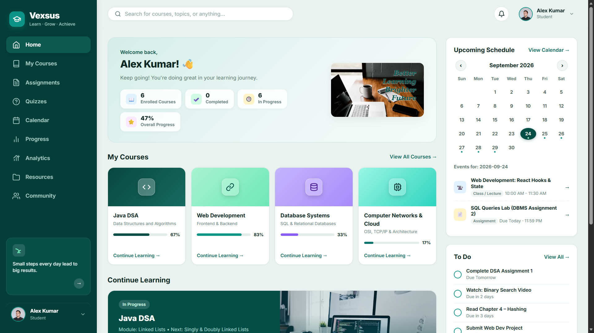

# Vexsus — Online Learning Dashboard

A modern, responsive **online learning dashboard** built with React and Vite. It gives students a single place to track courses, lessons, assignments, quizzes, progress, and notifications — with persistent state stored in the browser via `localStorage` (no backend required).

> Title: **Vexsus — Online Learning Dashboard** · Package name: `online-dashboard`

## 🔗 Live Demo

For a live website, click the link below:

**[Click here to view the live site](https://your-live-site-link-here.com)**

> ⚠️ *Placeholder link — replace `https://your-live-site-link-here.com` with the actual deployed URL.*

## Screenshots

### Home Page



## Tech Stack

| Layer      | Technology                                        |
| ---------- | ------------------------------------------------- |
| UI         | React 19 (`react`, `react-dom`)                   |
| Routing    | React Router DOM v7 (`BrowserRouter`)             |
| Build tool | Vite 8 (`@vitejs/plugin-react`)                   |
| Linting    | Oxlint                                            |
| State      | React Context API (`AppContext`) + `localStorage` |
| Styling    | Plain CSS with CSS variables / theming            |

## Getting Started

### Prerequisites

- Node.js 18+ (recommended: latest LTS)
- npm (comes with Node)

### Installation

```bash
npm install
```

### Development Server

```bash
npm run dev
```

Starts Vite with Hot Module Replacement (HMR). Open the printed local URL (default `http://localhost:5173`).

### Production Build

```bash
npm run build     # outputs optimized files to dist/
npm run preview   # serve the production build locally
```

### Linting

```bash
npm run lint      # runs Oxlint
```

## Demo Login

The app is protected by a simple client-side auth guard — unauthenticated users are redirected to `/login`. Use the demo credentials:

| Field    | Value                     |
| -------- | ------------------------- |
| Email    | `karthiekyan@example.com` |
| Password | `student123`              |

> Credentials are defined in `src/data/students.js` (`DEMO_CREDENTIALS`). Auth state persists in `localStorage`, so you stay logged in across refreshes until you log out.

## Features

- **Login / Protected routes** — `Protected` wrapper redirects unauthenticated users to `/login`.
- **Dashboard** — overview with stats, upcoming assignments, recommended resources, and activity.
- **Courses & Lessons** — browse courses, view course details, open lessons, and mark lessons complete.
- **Assignments** — track pending / submitted / graded / overdue statuses (persisted).
- **Quizzes** — take quizzes with timed attempts; best scores and attempt counts are saved.
- **Analytics & Progress** — quiz mastery, recent scores, and progress computed from completed lessons and quiz results.
- **Calendar** — monthly calendar widget with scheduled events.
- **Resources & Community** — curated learning resources and a community feed.
- **Notifications** — read / mark-all-read state persisted per user.
- **Profile & Settings** — student profile and app settings.
- **Light / Dark theme** — theme toggle applied via `data-theme` attribute and persisted.
- **Toast notifications** — transient success/error messages rendered by `AppProvider`.
- **Seeded demo data** — completed lessons, quiz results, and assignment statuses are seeded on first load for a realistic demo experience.

## Project Structure

```
online dashboard/
├── index.html                  # App entry HTML (title, fonts, favicon)
├── vite.config.js              # Vite + React plugin config
├── package.json                # Scripts & dependencies
├── public/
│   ├── favicon.svg
│   └── icons.svg
└── src/
    ├── main.jsx                # Root render: StrictMode > BrowserRouter > AppProvider > App
    ├── App.jsx                 # Route definitions + Protected guard + app shell
    ├── index.css               # Global styles, CSS variables, theming
    ├── assets/                 # Images & static assets
    ├── components/             # Reusable UI (Sidebar, Navbar, CourseCard, ChartCard, …)
    ├── context/
    │   └── AppContext.jsx      # Global state: auth, lessons, quizzes, assignments, theme, toasts
    ├── data/                   # Static demo data (courses, lessons, quizzes, assignments, …)
    ├── pages/                  # Route-level page components
    └── utils/                  # localStorage helpers, analytics, status utilities
```

## Routes

| Path                 | Page         | Notes             |
| -------------------- | ------------ | ----------------- |
| `/`                  | —            | Redirects to `/dashboard` |
| `/login`             | Login        | Public            |
| `/dashboard`         | Dashboard    | Protected         |
| `/courses`           | Courses      | Protected         |
| `/courses/:courseId` | CourseDetails | Protected        |
| `/lessons/:lessonId` | Lesson       | Protected         |
| `/assignments`       | Assignments  | Protected         |
| `/calendar`          | Calendar     | Protected         |
| `/resources`         | Resources    | Protected         |
| `/community`         | Community    | Protected         |
| `/quizzes`           | Quizzes      | Protected         |
| `/quizzes/:quizId`   | QuizAttempt  | Protected         |
| `/analytics`         | Analytics    | Protected         |
| `/progress`          | Progress     | Protected         |
| `/notifications`     | Notifications | Protected        |
| `/profile`           | Profile      | Protected         |
| `/settings`          | Settings     | Protected         |
| `*`                  | 404          | "Page not found"  |

## State & Persistence

Global state lives in `src/context/AppContext.jsx` and is persisted to `localStorage` via helpers in `src/utils/localStorage.js`. Keys include:

- `studentDashboardUser` — logged-in user
- `completedLessons` — completed lesson IDs
- `quizResults` — best score, attempts, and date per quiz
- `assignmentStatus` — status per assignment
- `theme` — `light` / `dark`
- `notificationsRead` — read notification IDs
- `profileData`, `appSettings` — profile & settings

To reset the demo data, clear the site's `localStorage` in your browser dev tools.

## Scripts Reference

| Script            | Command       | Description                       |
| ----------------- | ------------- | --------------------------------- |
| `npm run dev`     | `vite`        | Start dev server with HMR         |
| `npm run build`   | `vite build`  | Create optimized production build |
| `npm run preview` | `vite preview` | Preview the production build     |
| `npm run lint`    | `oxlint`      | Lint the codebase                 |

## Notes

- This is a **frontend-only** demo app — all data is static/seeded and stored client-side; there is no backend or real authentication.
- Images may load from external sources (e.g., Unsplash); a `SafeImage` component handles fallbacks gracefully.

